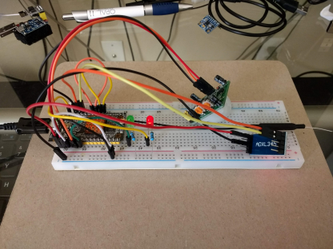
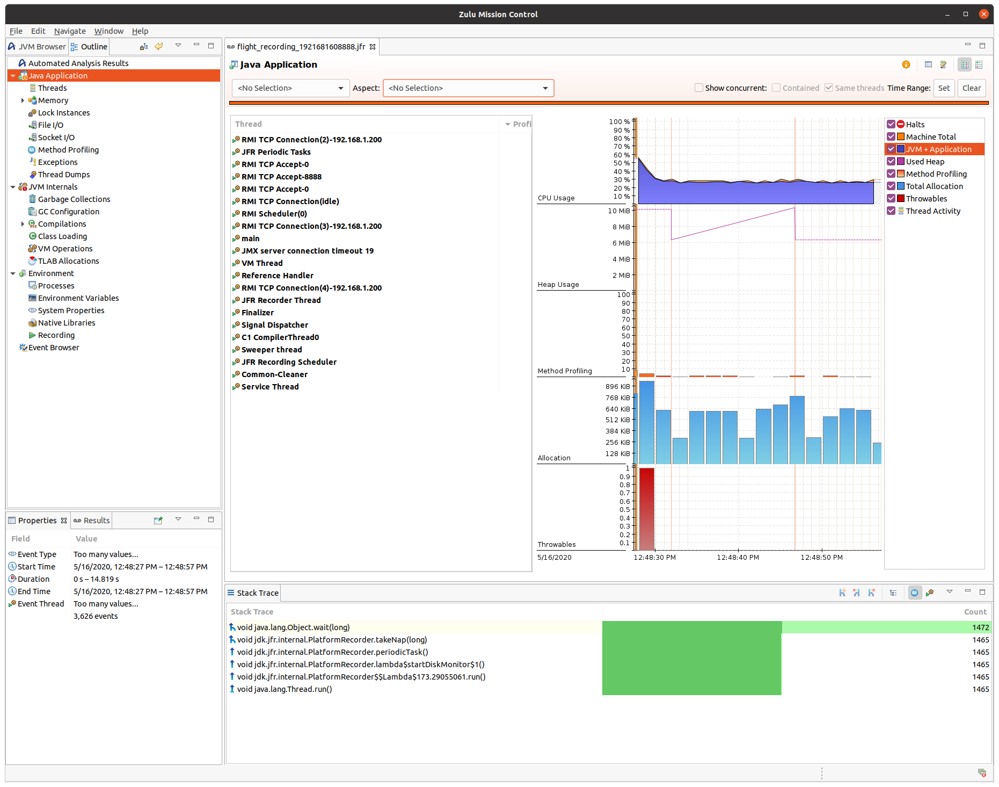

Java Periphery is a high performance library for GPIO, LED, PWM, SPI, I2C, MMIO
and Serial peripheral I/O interface access in userspace Linux. Rather than try to
build this from scratch I used [c-periphery](https://github.com/vsergeev/c-periphery)
and [HawtJNI](https://github.com/fusesource/hawtjni) to generate the JNI wrappers.
This saves a lot of hand coding and allows for easier synchronization with
c-periphery changes moving forward.
* Generates JNI source code for c-periphery.
* Generates an autoconf and msbuild source project to build the native library.
This gets attached to the Maven project as as the native source zip file.
* Builds the native source tar for the current platform.
* Built native library is stored in a platform specific jar. This gets attached
to the Maven project as a platform specific jar file.
* Cross platform MMIO GPIO that doesn't require one off code for each board. Only
a simple property file is required to map registers.
* All wrapper classes support AutoCloseable, so you can use the
[try-with-resources](https://docs.oracle.com/javase/tutorial/essential/exceptions/tryResourceClose.html)
statement to automatically close and free native resources. This prevents hard
to track down native memory leaks.
```
try (final var spi = new Spi("/dev/spidev1.0", 0, 500000)) {
    final var txBuf = new byte[128];
    // Change some data at beginning and end.
    txBuf[0] = (byte) 0xff;
    txBuf[127] = (byte) 0x80;
    final var rxBuf = new byte[128];
    Spi.spiTransfer(spi.getHandle(), txBuf, rxBuf, txBuf.length);
    logger.info(String.format("%02X, %02X", (short) rxBuf[0] & 0xff, (short) rxBuf[127] & 0xff));
}
```



Behold the FrankenDuo which is used to test all Java Periphery features.

Java Periphery will be targeting Armbian, but the code should work with most
Linux distributions. Demo apps are included that illustrate how to leverage the
bindings. The idea is to have consistent APIs across
[C](https://github.com/vsergeev/c-periphery),
[Python](https://github.com/vsergeev/python-periphery),
[Lua](https://github.com/vsergeev/lua-periphery),
[Dart](https://github.com/pezi/dart_periphery) and JVM languages without having
to use one off board specific drivers, 
[deprecated wiringPi](http://wiringpi.com/wiringpi-deprecated) or the
[deprecated sysfs](https://www.kernel.org/doc/html/latest/admin-guide/gpio/sysfs.html)
interface. The possibility of using other JVM based languages such as Groovy,
Kotlin, Scala, etc. opens up language opportunities that do not currently exist
in the IoT space.
* Why Linux userspace? This is really the only way to get cross platform
libraries to work since most SBCs have different chip sets. The trade off is
performance compared to native C written to specific chip sets. However, since
I'm wrapping C with JNI it guarantees the fastest userspace experience for Java.
* Why Armbian? Because Armbian supports many SBCs and the idea is to be truly
SBC cross platform. See [downloads](https://www.armbian.com/download).
* Why Java 17? Because Java 17 is the current LTS version of Java. Java 11 the
previous LTS release is end of life September 2023. I'm only moving forward
with Java. You can always create a fork and make a Java 8 or Java 11 version of
Java Periphery.
* Why Zulu OpenJDK? Because it's easy to download without all the crap Oracle
puts you through. You can always use another JDK 17 vendor, but you will have to
do that manually.

## Project comparison
In general it's nice to have a library of devices, but most libraries then have
limited board support. My choice was to support over a hundred boards and port
device code as needed. Also, by not using any board specific native code a new
board can be used right away. There's always tradeoffs, but I made portability
the main objective, not an afterthought. 
* [Pi4J](https://pi4j.com) limited to Raspberry Pi and JDK 11.
* [Bulldog](https://github.com/SilverThings/bulldog) only a few boards supported. One off native code required for each board.
* [diozero](https://github.com/mattjlewis/diozero) Almost 600 Java files compared to 33 for Java Periphery.
One off MMIO GPIO hand coded for each board instead of using simple configuration files.

## SBC configuration
* If you are using Armbian then use `armbian-config` or edit `/boot/armbianEnv.txt`
to configure various devices. Userspace devices are exposed through /dev or
/sys. Verify the device is showing up prior to trying demo apps.
    * `sudo apt install armbian-config`
* If you are not using Armbian then you will need to know how to configure
devices to be exposed to userspace for your Linux distribution and SBC model.
Check each log in scripts directory to be sure there were no errors after running
install.sh.
* Since linux 4.8 the GPIO sysfs interface is [deprecated](https://www.kernel.org/doc/html/latest/admin-guide/gpio/sysfs.html).
Userspace should use the character device instead.
* I have tested 32 bit and 64 bit boards using the latest Armbian release or in
the case of the Raspberry Pi Ubuntu Server. The ability to switch seamlessly
between boards gives you a wide range of SBC choices. I'm currently testing with
Ubuntu 20.04 LTS Focal Fossa using 5.4 to 5.9 kernels.

## Armbian and built in buttons
On the NanoPi Duo the built in button causes it to shutdown by default. You can
remove the r_gpio_keys section in the DTB as follows (this may work on other SBCs,
but you'll need to know the correct dtb file and section to remove) :
* `cd /boot/dtb`
* `sudo cp sun8i-h2-plus-nanopi-duo.dtb sun8i-h2-plus-nanopi-duo.dtb.old`
* `sudo dtc -@ -I dtb -O dts -o sun8i-h2-plus-nanopi-duo.dts sun8i-h2-plus-nanopi-duo.dtb`
* `sudo nano sun8i-h2-plus-nanopi-duo.dts`
    * Remove `r_gpio_keys` section
* `sudo dtc -@ -I dts -O dtb -o sun8i-h2-plus-nanopi-duo.dtb sun8i-h2-plus-nanopi-duo.dts`
* `reboot`

## Non-root access
If you want to access devices without root do the following (you can try udev
rules instead if you wish):
* `sudo usermod -a -G dialout username` (Use a non-root username)
* `sudo groupadd periphery`
* `sudo usermod -a -G periphery username` (Use a non-root username)
* `sudo nano /etc/rc.local`
<pre><code>chown -R root:periphery /dev/gpiochip* #/dev/gpiomem for sandbox
chmod -R ug+rw /dev/gpiochip* #/dev/gpiomem for sandbox
chown -R root:periphery /dev/i2c*
chmod -R ug+rw /dev/i2c*
chown -R root:periphery /dev/spidev*
chmod -R ug+rw /dev/spidev*
chown -R root:periphery /sys/devices/platform/leds/leds
chmod -R ug+rw /sys/devices/platform/leds/leds</code></pre>
* PWM udev rules
    * You need kernel 4.16 or greater to use non-root access for PWM.
    * `sudo nano /etc/udev/rules.d/99-pwm.rules`
    <pre><code>SUBSYSTEM=="pwm*", PROGRAM="/bin/sh -c '\
  chown -R root:periphery /sys/class/pwm && chmod -R 770 /sys/class/pwm;\
  chown -R root:periphery /sys/devices/platform/soc/*.pwm/pwm/pwmchip* && chmod -R 770 /sys/devices/platform/soc/*.pwm/pwm/pwmchip*\
  '"</code></pre>

## Download project
* `sudo apt install git`
* `cd ~/`
* `git clone --depth 1 https://github.com/sgjava/java-periphery.git`

## Install script
The install script assumes a clean OS install. If you would like to install on
a OS with your own version of Java 17, etc. then you can look at what install.sh
does and do it manually. What does the script do?
* Install build dependencies for HawtJNI 
* Installs Zulu OpenJDK 17 to /usr/lib/jvm (JDK 11 is used for ARM32)
* Installs Maven to /opt
* Build HawtJNI (using my fork that works with JDK 17)
* Build Java Periphery
The Java Periphery POM uses download-maven-plugin to download c-periphery source
to `src/main/native-package/src`. The files are cached in
`~/.m2/repository/.cache/download-maven-plugin`, so they are not downloaded
again unless they are updated. If you want to build the GPIO C code to use sysfs
comment out `<configureArgs>` in the `hawtjni-maven-plugin` section of the POM.

### Run script
* `cd ~/java-periphery/scripts`
* `./install.sh`
* Check various log files if you have issues running the demo code. Something
could have gone wrong during the build/bindings generation processes.

### Build java-periphery with proper gpio.h
The gcc default include paths usually do not point to the latest gpio.h header.
In order to use the latest features in c-periphery you will need to use the
correct gpio.h include. After the install.sh script completes:
* `sudo armbian-config` Software, Headers_install
* `grep -R -i "GPIOHANDLE_REQUEST_BIAS_DISABLE" /usr/src`
* `mkdir -p $HOME/include/linux`
* `cp /usr/src/linux-headers-5.9.11-sunxi/include/uapi/linux/gpio.h $HOME/include/linux/.` (use actual path)
* `cd ~/java-periphery`
* `mvn clean install "-Dcflags=-I$HOME/include"`
* Add `-Dmaven.compiler.source=11 -Dmaven.compiler.target=11` for ARM32

## High performance GPIO using MMIO
I have created a generic way to achieve fast GPIO for times when performance (bit
banging, software based PWM, low CPU latency, etc) is required. I have written a
mapper, so you can extract the  data register masks without having to do it by
hand from the datasheet. Doing this totally by hand is tedious and error prone.
The method I use is using a well know interface (GPIO device) to make changes
and detecting register deltas. You still need to create a [input file](https://github.com/sgjava/java-periphery/blob/master/src/main/resources/duo.properties)
with various board specific parameters. Make sure you disable all hardware in
armbian-config System, Hardware and remove console=serial from
/boot/armbianEnv.txt. You want multi-function pins to act as GPIO pins.

NanoPi Duo (H2+) example:
* `sudo java -cp $HOME/java-periphery/target/java-periphery-1.0.0-SNAPSHOT.jar:$HOME/java-periphery/target/java-periphery-1.0.0-SNAPSHOT-linux32.jar com.codeferm.periphery.mmio.Gen -i duo.properties -o duo-map.properties`
* `sudo java -cp $HOME/java-periphery/target/java-periphery-1.0.0-SNAPSHOT.jar:$HOME/java-periphery/target/java-periphery-1.0.0-SNAPSHOT-linux32.jar com.codeferm.periphery.mmio.Perf -i duo-map.properties -d 0 -l 203`

NanoPi Neo Plus2 (H5) example:
* `sudo java -cp $HOME/java-periphery/target/java-periphery-1.0.0-SNAPSHOT.jar:$HOME/java-periphery/target/java-periphery-1.0.0-SNAPSHOT-linux64.jar com.codeferm.periphery.mmio.Gen -i neoplus2.properties -o neoplus2-map.properties`
* `sudo java -cp $HOME/java-periphery/target/java-periphery-1.0.0-SNAPSHOT.jar:$HOME/java-periphery/target/java-periphery-1.0.0-SNAPSHOT-linux64.jar com.codeferm.periphery.mmio.Perf -i neoplus2-map.properties -d 1 -l 203`

As you can see above the same performance test code works on a 32 bit H2+ and a
64 bit H5 CPU. This means almost all boards can be easily supported with
the right input file. This is probably the only high performance GPIO code that
is truly cross platform. No custom adapters or other one off code is required
currently. Also, I use the same pin numbers as the GPIO device, so no goofy
wiringPi or BCM pin numbering. Keep in mind that only one core is used, so the 
CPU will never exceed 25% on a quad core system.

If you want to map your own board you start by getting the data sheet and
finding the data registers. I've written a little memory tool
[MemScan](https://github.com/sgjava/java-periphery/blob/master/src/main/java/com/codeferm/periphery/mmio/MemScan.java)
that will allow you to see what bits change for a range of registers using mode,
data and pull operations. For example on the ODROID C2 lets look at chip 0 and
line 9:

`sudo java -cp $HOME/java-periphery/target/java-periphery-1.0.0-SNAPSHOT.jar:$HOME/java-periphery/target/java-periphery-1.0.0-SNAPSHOT-linux64.jar com.codeferm.periphery.mmio.MemScan -a 0xc8100024 -w 0x03 -d 0 -l 9`

Output:

```11:55:39.342 [main] DEBUG MemScan - Memory address 0xc8100024 words 0x00000003
11:55:39.538 [main] INFO  MemScan - Mode difference found at offset 0x00000000 before 0xa0003ef7 after 0xa0003cf7 difference 0x00000200
11:55:39.540 [main] INFO  MemScan - Mode difference found at offset 0x00000004 before 0x80003ef7 after 0x80003cf7 difference 0x00000200
11:55:39.543 [main] INFO  MemScan - Data difference found at offset 0x00000000 before 0xa0003cf7 after 0xa2003cf7 difference 0x02000000
11:55:39.545 [main] INFO  MemScan - Data difference found at offset 0x00000004 before 0x80003cf7 after 0x80003ef7 difference 0x00000200
11:55:39.548 [main] ERROR MemScan - Device 0 line 9 Error Kernel version does not support configuring GPIO line bias
```

Note the bias error is due to no compiling with latest gpio.h header.

## GPIO Performance using Perf
Note that most performance tests focus on writes and not CPU overhead, so it's
hard to compare. Technically you will actually be doing something like bit
banging to simulate a protocol, so you need extra CPU bandwidth to do that.
Please note write frequency is based on square wave (rapid on/off). You can
increase clock speed to improve performance on some boards. I used the OS
defaults.

|SBC              |OS           |CPU Freq|GPIOD Write KHz|MMIO Write KHz|Average CPU|
| --------------- | ----------- | ------ | ------------- | ------------ | --------- |
|Nano Pi Duo v1.0 |Armbian Focal|1.0 GHz |242            |1880          |25%        |
|Nano Pi M1       |Armbian Focal|1.2 GHz |320            |2355          |25%        |
|Nano Pi Neo Plus2|Armbian Focal|1.0 GHz |347            |2356          |25%        |
|Odroid C2        |Armbian Focal|1.5 GHz |365            |2346          |25%        |
|Odroid XU4       |Armbian Focal|2.0 GHz | 44            | 300          |12%        |
|Raspberry Pi 3   |Ubuntu Focal |1.2 GHz |119            |4541          |25%        |

## How GPIO pins are mapped
This is based on testing on a NanoPi Duo. gpiochip0 starts at 0 and gpiochip1
start at 352. Consider the following table:

|Name                           |Chip Name |dev |sysfs|
| ----------------------------- | -------- | -- | --- |
|DEBUG_TX(UART_TXD0)/GPIOA4     |gpiochip0 | 004|  004|
|DEBUG_RX(UART_RXD0)/GPIOA5/PWM0|gpiochip0 | 005|  005|
|I2C0_SCL/GPIOA11               |gpiochip0 | 011|  011|
|I2C0_SDA/GPIOA12               |gpiochip0 | 012|  012|
|UART3_TX/SPI1_CS/GPIOA13       |gpiochip0 | 013|  013|
|UART3_RX/SPI1_CLK/GPIOA14      |gpiochip0 | 014|  014|
|UART3_RTS/SPI1_MOSI/GPIOA15    |gpiochip0 | 015|  015|
|UART3_CTS/SPI1_MISO/GPIOA16    |gpiochip0 | 016|  016|
|UART1_TX/GPIOG6                |gpiochip0 | 198|  198|
|UART1_RX/GPIOG7                |gpiochip0 | 199|  199|
|GPIOG11                        |gpiochip0 | 203|  203|
|ON BOARD BUTTON                |gpiochip1 | 003|  355|
|GPIOL11/IR-RX                  |gpiochip1 | 011|  363|

So basically you just need to know the starting number for each chip and realize
GPIO character devices always starts at 0 and calculate the offset. Thus gpiochip1
starts at 352 and the on board button is at 355, so 355 - 352 = 3 for GPIO
character device.

## Run demos
* `java -cp $HOME/java-periphery/target/java-periphery-1.0.0-SNAPSHOT.jar:$HOME/java-periphery/target/java-periphery-1.0.0-SNAPSHOT-linux32.jar com.codeferm.periphery.demo.LedBlink -d /dev/gpiochip0 -l 203`

Note that the native library jar has a suffix such as linux32, so depending on
your target platform it could be different. To see a list of demos 
[browse](https://github.com/sgjava/java-periphery/tree/master/src/main/java/com/codeferm/periphery/demo)
code.

## Use Java Periphery in your own Maven projects
After bulding Java Periphery simpily add the following artifact:
```
<groupId>com.codeferm</groupId>
<artifactId>java-periphery</artifactId>
<version>1.0.0-SNAPSHOT</version>
```

## Zulu Mission Control (JDK 17 not supported yet)
[Azul Mission Control](https://www.azul.com/products/components/zulu-mission-control) allows
you to profile your applications.
[Download](https://www.azul.com/products/components/zulu-mission-control/#block-download)
zmc and launch on your desktop. To profile your Java Periphery application use:
`java -XX:+FlightRecorder -Djava.rmi.server.hostname=your_ip -Dcom.sun.management.jmxremote=true -Dcom.sun.management.jmxremote.port=8888 -Dcom.sun.management.jmxremote.authenticate=false -Dcom.sun.management.jmxremote.ssl=false -cp java-periphery-1.0.0-SNAPSHOT.jar:java-periphery-1.0.0-SNAPSHOT-linux32.jar com.codeferm.periphery.demo.GpioPerf`


